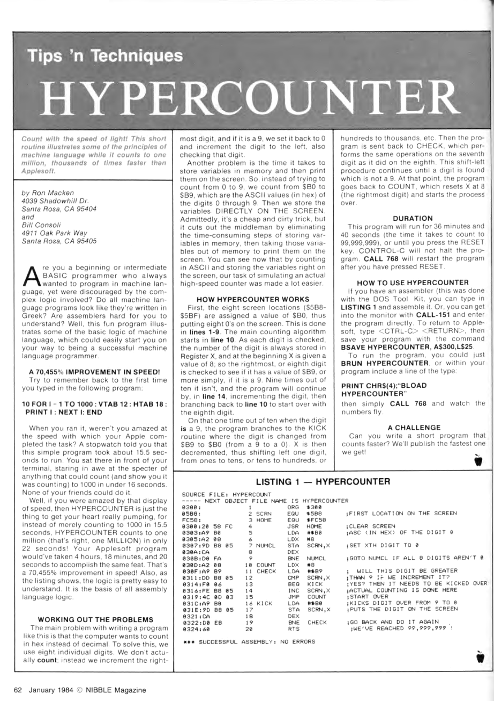

# Count to 1,000,000 on Apple 2 in 6502 assembly

The January 1984 issue of Nibble Magazine


Had this article `HYPERCOUNTER` by Ron Macken and Bill Consoli on page 62:



Unfortunately it is slow. :-/

The fastest way to count from 1 to 1,000,000 is to _only_ change
the bytes that _actually_ change from x to x+1.

We can write a C program to spit out 6502 assembly for us:

```C++
    for( i = 0; i < end; i++ )
    {
        int x = NUM-1;

        char before[ NUM+1 ];
        char after [ NUM+1 ];

        sprintf( before, "%0*d", NUM, i+0 );
        sprintf( after , "%0*d", NUM, i+1 );

        while( x > 0 )
        {
            int delta = after[x] - before[x];
            if( delta == 0 )
                ; // skip digit
            else
            if( delta == 1 )
            {
                if( (before[x] == '0') && (x != 1) )
                    one( x );
                else
                if( (before[x] == '1') && (x != 1) )
                    two( x );
                else
                    inc( x );
            }
            else
            if( delta == -9 )
                zer( x );

            x--;
        }
```

You'll notice there are 4 variations of x++.  Why 4? Consider what happens to each digit:

* 0 -> 1
* 1 -> 2
* 9 -> 0
* remaining 2,3,4,5,6,7,8

Since the 6502 has 3 registers, A, X, and Y we have 3 specializations where we can cache the constant values in registers:

* X = 0
* Y = 1
* A = 2


# Memory Size

Depending on how much we want to loop-unroll we get this tradeoff:


| End     | Memory  | Size      |
|--------:|--------:|:----------|
|    1000 |   $1568 | `<  1 KB` |
|   10000 |   $8A98 | `~ 33 KB` |
|  100000 |  $51E75 | `>325 KB` |
| 1000000 | $32E517 | `>  3 MB` |

We'll unroll the first 10,000 numbers so it fits into the 48KB of RAM.

With a little bit of setup code ...

```asm
digit = $401           ; VTAB 1:HTAB 2

    ORG $800

Prologue
    LDA #'2' + $80                  ; +2 = 2
    LDX #'0' + $80                  ; +2 = 4
    LDY #'1' + $80      ; A,BCD,EFG ; +2 = 6
    STX digit - 1       ; 0,BCD,EFG ; +4 = 10
    STX digit + 0       ; 0,0CD,EFG ; +4 = 14
    STX digit + 1       ; 0,00D,EFG ; +4 = 18
    STX digit + 2       ; 0,000,EFG ; +4 = 22
    STX digit + 3       ; 0,000,0FG ; +4 = 26
    STX digit + 4       ; 0,000,00G ; +4 = 30
;   STX digit + 5       ; 0,000,000 ; +4 = 34 ; <-- not needed since Count_10_000 sets to '1'

Work
    JSR Count_100_000   ; 100000
    JSR Count_100_000   ; 200000
    JSR Count_100_000   ; 300000
    JSR Count_100_000   ; 400000
    JSR Count_100_000   ; 500000
    JSR Count_100_000   ; 600000
    JSR Count_100_000   ; 700000
    JSR Count_100_000   ; 800000
    JSR Count_100_000   ; 900000
    JSR Count_100_000   ; 000000

Epilogue                            ;==10
    STX digit + 0       ; 000000
    STY digit - 1       ;1000000
    RTS

Count_100_000
    JSR Count_10_000    ; 010000
    JSR Count_10_000    ; 020000
    JSR Count_10_000    ; 030000
    JSR Count_10_000    ; 040000
    JSR Count_10_000    ; 050000
    JSR Count_10_000    ; 060000
    JSR Count_10_000    ; 070000
    JSR Count_10_000    ; 080000
    JSR Count_10_000    ; 090000
    JSR Count_10_000    ;  00000
    STX digit + 1       ; 000000
    INC digit + 0       ; 100000
    RTS

Count_10_000
```

... Bob's your uncle.

Is that the best we can do?

No, we can continue unrolling even more!

```asm
; 100000
    JSR Count_10_000    ; 010000
    JSR Count_10_000    ; 020000
    JSR Count_10_000    ; 030000
    JSR Count_10_000    ; 040000
    JSR Count_10_000    ; 050000
    JSR Count_10_000    ; 060000
    JSR Count_10_000    ; 070000
    JSR Count_10_000    ; 080000
    JSR Count_10_000    ; 090000
    JSR Count_10_000    ; 0:0000
    STX digit + 1       ; 000000
    INC digit + 0       ; 100000

; 200000
    JSR Count_10_000    ; 010000
    JSR Count_10_000    ; 020000
    JSR Count_10_000    ; 030000
    JSR Count_10_000    ; 040000
    JSR Count_10_000    ; 050000
    JSR Count_10_000    ; 060000
    JSR Count_10_000    ; 070000
    JSR Count_10_000    ; 080000
    JSR Count_10_000    ; 090000
    JSR Count_10_000    ; 1:0000
    STX digit + 1       ; 100000
    INC digit + 0       ; 200000

; 300000
    JSR Count_10_000    ; 010000
    JSR Count_10_000    ; 020000
    JSR Count_10_000    ; 030000
    JSR Count_10_000    ; 040000
    JSR Count_10_000    ; 050000
    JSR Count_10_000    ; 060000
    JSR Count_10_000    ; 070000
    JSR Count_10_000    ; 080000
    JSR Count_10_000    ; 090000
    JSR Count_10_000    ; 2:0000
    STX digit + 1       ; 200000
    INC digit + 0       ; 300000

; 400000
    JSR Count_10_000    ; 010000
    JSR Count_10_000    ; 020000
    JSR Count_10_000    ; 030000
    JSR Count_10_000    ; 040000
    JSR Count_10_000    ; 050000
    JSR Count_10_000    ; 060000
    JSR Count_10_000    ; 070000
    JSR Count_10_000    ; 080000
    JSR Count_10_000    ; 090000
    JSR Count_10_000    ; 3:0000
    STX digit + 1       ; 400000
    INC digit + 0       ; 400000

; 500000
    JSR Count_10_000    ; 010000
    JSR Count_10_000    ; 020000
    JSR Count_10_000    ; 030000
    JSR Count_10_000    ; 040000
    JSR Count_10_000    ; 050000
    JSR Count_10_000    ; 060000
    JSR Count_10_000    ; 070000
    JSR Count_10_000    ; 080000
    JSR Count_10_000    ; 090000
    JSR Count_10_000    ; 4:0000
    STX digit + 1       ; 400000
    INC digit + 0       ; 500000

; 600000
    JSR Count_10_000    ; 010000
    JSR Count_10_000    ; 020000
    JSR Count_10_000    ; 030000
    JSR Count_10_000    ; 040000
    JSR Count_10_000    ; 050000
    JSR Count_10_000    ; 060000
    JSR Count_10_000    ; 070000
    JSR Count_10_000    ; 080000
    JSR Count_10_000    ; 090000
    JSR Count_10_000    ; 5:0000
    STX digit + 1       ; 500000
    INC digit + 0       ; 600000

; 700000
    JSR Count_10_000    ; 010000
    JSR Count_10_000    ; 020000
    JSR Count_10_000    ; 030000
    JSR Count_10_000    ; 040000
    JSR Count_10_000    ; 050000
    JSR Count_10_000    ; 060000
    JSR Count_10_000    ; 070000
    JSR Count_10_000    ; 080000
    JSR Count_10_000    ; 090000
    JSR Count_10_000    ; 6:0000
    STX digit + 1       ; 600000
    INC digit + 0       ; 700000

; 800000
    JSR Count_10_000    ; 010000
    JSR Count_10_000    ; 020000
    JSR Count_10_000    ; 030000
    JSR Count_10_000    ; 040000
    JSR Count_10_000    ; 050000
    JSR Count_10_000    ; 060000
    JSR Count_10_000    ; 070000
    JSR Count_10_000    ; 080000
    JSR Count_10_000    ; 090000
    JSR Count_10_000    ; 7:0000
    STX digit + 1       ; 700000
    INC digit + 0       ; 800000

; 900000
    JSR Count_10_000    ; 010000
    JSR Count_10_000    ; 020000
    JSR Count_10_000    ; 030000
    JSR Count_10_000    ; 040000
    JSR Count_10_000    ; 050000
    JSR Count_10_000    ; 060000
    JSR Count_10_000    ; 070000
    JSR Count_10_000    ; 080000
    JSR Count_10_000    ; 090000
    JSR Count_10_000    ; 8:0000
    STX digit + 1       ; 800000
    INC digit + 0       ; 900000

;1000000
    JSR Count_10_000    ; 010000
    JSR Count_10_000    ; 020000
    JSR Count_10_000    ; 030000
    JSR Count_10_000    ; 040000
    JSR Count_10_000    ; 050000
    JSR Count_10_000    ; 060000
    JSR Count_10_000    ; 070000
    JSR Count_10_000    ; 080000
    JSR Count_10_000    ; 090000
    JSR Count_10_000    ; 9:0000
    STX digit + 1       ; 900000    ; +4 = 64
    STX digit + 0       ; 000000    ; +4 = 68

Epilogue                            ;==10
    STY digit - 1       ;1000000    ; +4
    RTS                             ; +6
```

# Total Time

```
Prologue     = +30
Work         = +730
Count_10_000 = +6,000,600
Epilogue     = +10
==================
6,001,370 cycles
```

QED.

Who knew counting could be so complicatd! :-)

